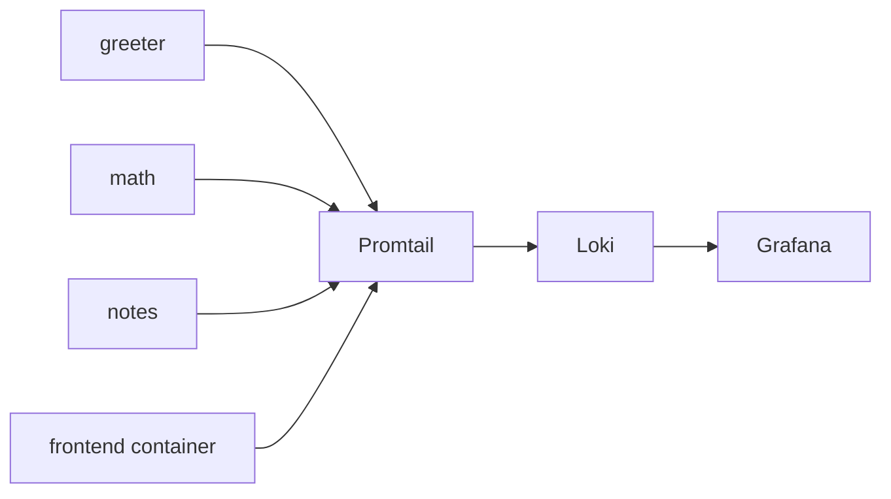

# Konzept: Grafana, Loki und Promtail fuer das Microservice-Testprojekt

## Ausgangslage

Das Projekt besteht aktuell aus diesen Compose-Services:

- `greeter`
- `math`
- `notes`
- `frontend`
- `workspace`

Ziel ist eine moeglichst einfache Log-Pipeline fuer die Container des Demo-Stacks. Es geht in dieser Phase nur um zentrales Logging. Metriken, Traces und Alerting sind noch nicht Teil des Umfangs.

## Wichtiger Hinweis zu Promtail

Promtail ist seit Maerz 2026 End of Life. Fuer ein kleines Lern- oder Demo-Projekt kann Promtail trotzdem noch als einfache Zwischenloesung verwendet werden. Fuer alles, was laenger leben oder spaeter erweitert werden soll, sollte dieselbe Architektur mittelfristig auf Grafana Alloy umgestellt werden.

Fuer dieses Projekt ist daher das Ziel:

- kurzfristig: einfaches Logging mit Loki + Promtail + Grafana
- spaeter optional: nahezu gleiche Pipeline mit Alloy statt Promtail

## Zielbild

- Alle Python-Services schreiben weiter auf `stdout` und `stderr`.
- Das React-Frontend liefert in Loki nur die Logs des Vite-Containers.
- Browser-Konsole und Client-seitige React-Logs sind in Phase 1 nicht enthalten.
- Promtail sammelt Container-Logs aus Docker ein und schiebt sie an Loki.
- Grafana liest Loki als Datenquelle und bietet eine einfache Log-Ansicht pro Service.

## Warum diese Variante zum Projekt passt

- Es sind bereits einzelne Docker-Compose-Services vorhanden.
- Die FastAPI-Services loggen schon ueber Uvicorn auf `stdout`.
- Es wird kein zusaetzlicher Agent in den Python-Services benoetigt.
- Die Anbindung bleibt fuer ein Testprojekt klein und nachvollziehbar.
- Die gleiche Struktur funktioniert spaeter auch mit mehr Services.

## Architektur



## Empfohlener Scope fuer Phase 1

In Phase 1 sollten nur diese Container geloggt werden:

- `greeter`
- `math`
- `notes`
- `frontend`

Der `workspace`-Container sollte zunaechst ausgeschlossen werden, damit keine Shell- und Editor-Nebengeraeusche in Loki landen.

## Technische Grundidee

### 1. Logs ausschliesslich ueber Container-stdout sammeln

Die einfachste und sauberste Variante fuer dieses Projekt ist:

- Python-Services schreiben strukturarm oder spaeter strukturiert auf `stdout`
- der Vite-Container schreibt seine Server-Logs ebenfalls auf `stdout`
- Promtail liest diese Container-Logs ein

Damit entfaellt in Phase 1 jede Dateilogik in den Anwendungen selbst.

### 2. Loki als zentrales Log-Backend

Loki speichert die Logs lokal in einem Docker-Volume. Fuer die Demo reicht eine kurze Aufbewahrung, zum Beispiel 7 Tage.

### 3. Grafana mit vorkonfigurierter Loki-Datenquelle

Grafana sollte automatisch mit einer Loki-Datenquelle starten, damit nach `docker compose up --build` keine manuelle UI-Konfiguration noetig ist.

## Empfohlene Compose-Erweiterung

Die Observability-Komponenten koennen direkt in die bestehende `docker-compose.yml` aufgenommen werden. Alternativ waere spaeter auch eine zweite Datei wie `docker-compose.observability.yml` moeglich. Fuer dieses kleine Projekt ist eine gemeinsame Compose-Datei aber einfacher.

Geplante zusaetzliche Services:

- `loki`
- `promtail`
- `grafana`

Geplante zusaetzliche Volumes:

- `loki-data`
- `grafana-data`
- optional `promtail-positions`

## Empfohlene Ordnerstruktur fuer eine spaetere Umsetzung

```text
monitoring/
  loki/
    config.yml
  promtail/
    config.yml
  grafana/
    provisioning/
      datasources/
      dashboards/
```

## Beschriftung der bestehenden Services

Damit die Logs in Loki sinnvoll filterbar sind, sollten die App-Container feste Labels erhalten. Minimal sinnvoll sind:

- `app=microservice-test`
- `env=dev`
- `service=greeter|math|notes|frontend`
- `logging=enabled`

Diese Labels sollten direkt in den Compose-Services gesetzt werden. Promtail uebernimmt sie dann als Loki-Labels oder mappt sie ueber `relabel_configs` um.

## Promtail-Konzept

Promtail soll nur Container mit `logging=enabled` sammeln. Dadurch bleibt der Scope kontrolliert.

Beispielhafte Konfigurationsidee:

```yaml
server:
  http_listen_port: 9080

positions:
  filename: /tmp/positions.yaml

clients:
  - url: http://loki:3100/loki/api/v1/push

scrape_configs:
  - job_name: docker
    docker_sd_configs:
      - host: unix:///var/run/docker.sock
        refresh_interval: 5s
    pipeline_stages:
      - docker: {}
    relabel_configs:
      - source_labels: [__meta_docker_container_label_logging]
        regex: enabled
        action: keep
      - source_labels: [__meta_docker_container_label_service]
        target_label: service
      - source_labels: [__meta_docker_container_label_app]
        target_label: app
      - source_labels: [__meta_docker_container_label_env]
        target_label: env
      - source_labels: [__meta_docker_container_name]
        regex: '/(.*)'
        target_label: container
```

Wichtig dabei:

- die Labels muessen klein und stabil bleiben
- keine Request-IDs oder User-IDs als Loki-Labels verwenden
- `service`, `app`, `env` und `container` reichen fuer dieses Projekt aus

## Loki-Konzept

Fuer die Demo reicht eine Single-Binary-Loki-Instanz mit lokalem Storage. Wichtige Punkte:

- Speicherung in einem benannten Docker-Volume
- kurze Retention, zum Beispiel 7 Tage
- nur lokale Nutzung, keine externe Freigabe noetig
- Port `3100` muss nicht zwingend auf den Host freigegeben werden, wenn nur Grafana darauf zugreift

## Grafana-Konzept

Grafana soll in diesem Projekt drei Aufgaben uebernehmen:

- vorkonfigurierte Loki-Datenquelle laden
- eine einfache Explore-Oberflaeche fuer Logs bereitstellen
- spaeter ein kleines Dashboard pro Service anzeigen

Minimal sinnvoll fuer Phase 1:

- Host-Port `3000` freigeben
- Admin-Zugang fuer Development ueber `.env` oder einfache Dev-Werte
- automatische Provisionierung der Loki-Datenquelle

## Konkrete Log-Labels fuer das Projekt

Empfohlene Loki-Labels:

- `app="microservice-test"`
- `env="dev"`
- `service="greeter"|"math"|"notes"|"frontend"`
- `container="..."`

Beispielhafte spaetere Abfragen in Grafana:

```logql
{app="microservice-test"}
```

```logql
{service="greeter"} |= "Hello"
```

```logql
{service="math"} |= "POST /calculate"
```

## Einschraenkungen und Risiken

### 1. Promtail ist EOL

Das ist die groesste fachliche Einschraenkung. Deshalb sollte das hier klar als Lern- oder Uebergangsloesung dokumentiert werden.

### 2. Frontend-Logs sind nur Container-Logs

Der `frontend`-Container liefert nur Vite-Server-Logs. Browser-seitige `console.log`-Ausgaben oder Fehler im ausgefuehrten React-Code landen damit nicht automatisch in Loki.

Wenn spaeter auch echte Frontend-Runtime-Logs gewuenscht sind, braucht es eine zusaetzliche Client-zu-Backend- oder Client-zu-Collector-Anbindung.

### 3. Docker-Socket-Zugriff

Promtail benoetigt in dieser Variante Zugriff auf Docker-Metadaten. Das ist fuer Development akzeptabel, sollte aber bewusst nur lokal eingesetzt werden.

### 4. Windows und Docker Desktop

Da das Projekt auf Windows entwickelt wird, sollte die spaetere Umsetzung mit Docker Desktop und WSL2 getestet werden. Gerade beim Socket-Zugriff ist das der wichtigste Technikpunkt der Integration.

## Empfohlener Umsetzungsplan

1. `monitoring/`-Ordner mit Loki-, Promtail- und Grafana-Konfiguration anlegen.
2. `loki`, `promtail` und `grafana` in `docker-compose.yml` aufnehmen.
3. Die vier App-Services mit stabilen Logging-Labels versehen.
4. `workspace` bewusst von der Erfassung ausschliessen.
5. Grafana-Datenquelle automatisch provisionieren.
6. `.devcontainer/devcontainer.json` um Port `3000` erweitern.
7. Mit `docker compose up --build` pruefen, ob nach Requests an `greeter`, `math` und `notes` Logs in Grafana sichtbar sind.

## Definition of Done fuer die spaetere Umsetzung

- `docker compose up --build` startet auch Grafana, Loki und Promtail.
- Grafana ist unter `http://localhost:3000` erreichbar.
- Die Container `greeter`, `math`, `notes` und `frontend` tauchen innerhalb weniger Sekunden in Loki auf.
- Logs sind mindestens nach `service` filterbar.
- Die README beschreibt kurz, wie man Logs in Grafana prueft.

## Empfehlung

Fuer dieses Projekt ist die Kombination aus Loki + Promtail + Grafana als naechster Schritt technisch sinnvoll, solange sie klar als Demo-Loesung dokumentiert wird. Wenn das Logging danach bestehen bleiben soll, sollte direkt im Anschluss ein zweiter Schritt zur Migration von Promtail auf Grafana Alloy geplant werden.